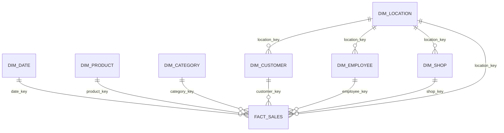

# Проектирование Gold Layer для EcoMarket

## 1. Бизнес-процесс

Основной бизнес-процесс, который моделируется в DWH, — это продажа товаров в сети продуктовых магазинов EcoMarket.

Событие продажи происходит тогда, когда клиент покупает товар в магазине, а продажу обрабатывает сотрудник в конкретную дату и время.

Анализ строится на основе транзакций продаж из Silver Layer.

Основные аналитические вопросы:

- какая выручка по месяцам, магазинам, городам, странам и категориям;
- какие товары продаются лучше всего;
- какие клиенты приносят наибольшую выручку;
- какие сотрудники приносят наибольшую выручку и прибыль;
- есть ли аномалии в ежедневной выручке магазинов;
- какие категории товаров имеют сезонные всплески продаж.

## 2. Grain

Grain — это уровень детализации таблицы фактов.

Grain таблицы фактов `gold.fact_sales` определяется следующим образом:

Одна строка в `fact_sales` представляет одну транзакцию продажи из таблицы `silver.silver_sales`, идентифицируемую полем `sales_id`.

Это означает, что таблица фактов является таблицей типа Transaction Fact.

Выбранный grain даёт максимальную гибкость для аналитики:

- продажи можно агрегировать по дате, месяцу, магазину, городу, стране, товару, категории, клиенту и сотруднику;
- все метрики хранятся на одном уровне детализации — уровне одной продажи;
- в таблице фактов не смешиваются агрегированные месячные или дневные итоги с транзакционными данными;
- все foreign keys соответствуют одной транзакции продажи, что предотвращает неоднозначные связи many-to-many внутри таблицы фактов.

## 3. Star Schema

Gold Layer использует модель Star Schema.

Центральная таблица фактов:

- fact_sales

Таблицы измерений:

- dim_date
- dim_product
- dim_category
- dim_customer
- dim_employee
- dim_shop
- dim_location

## 4. Таблица фактов

Таблица фактов: `gold.fact_sales`

Тип таблицы фактов: Transaction Fact

Primary key:

- sales_key

Business key:

- sales_id

Foreign keys:

- date_key
- product_key
- category_key
- customer_key
- employee_key
- shop_key
- location_key

Метрики:

- quantity
- unit_price
- gross_revenue
- discount_rate
- discount_amount
- net_revenue
- profit
- margin_percent

Важное допущение:

В исходных данных нет себестоимости товара. Поэтому прибыль рассчитывается как 20% от чистой выручки.

Формулы:

- gross_revenue = quantity * unit_price
- discount_amount = gross_revenue - net_revenue
- profit = net_revenue * 0.20
- margin_percent = profit / net_revenue * 100

## 5. Таблицы измерений

### dim_date

Тип: Regular Dimension

Business key:

- full_date

Surrogate key:

- date_key

Атрибуты:

- full_date
- day_of_week
- week_num
- month_num
- month_name
- quarter_num
- year_num

### dim_product

Тип: SCD Type 2 Dimension

Business key:

- product_id

Surrogate key:

- product_key

Атрибуты:

- product_name
- category_id
- category_name
- price
- class
- resistant
- is_allergic
- vitality_days
- valid_from_dt
- valid_to_dt
- is_current

SCD2-поля:

- valid_from_dt
- valid_to_dt
- is_current

Логика:

Если атрибуты товара изменяются, старая версия товара закрывается с помощью `is_current = false`, а новая актуальная версия добавляется отдельной строкой.

### dim_category

Тип: Regular Dimension

Business key:

- category_id

Surrogate key:

- category_key

### dim_customer

Тип: Regular Dimension

Business key:

- customer_id

Surrogate key:

- customer_key

### dim_employee

Тип: Regular Dimension

Business key:

- employee_id

Surrogate key:

- employee_key

### dim_shop

Тип: Regular Dimension

Business key:

- shop_id

Surrogate key:

- shop_key

### dim_location

Тип: Regular Dimension

Business key:

- city_id

Surrogate key:

- location_key

Таблица `dim_location` используется для BI-фильтров по стране и городу.

## 6. Data Marts

Mart Layer создаётся поверх Gold Layer.

Схема:

- mart

Views:

- mart_daily_anomaly
- mart_shop_daily
- mart_customer_behavior
- mart_employee_performance
- mart_product_seasonality

Витрины предназначены для BI dashboard и содержат денормализованные аналитические данные.

## 7. ER Diagram

Ниже представлена ER-диаграмма Gold Layer.

Модель построена по принципу Star Schema: в центре находится таблица фактов `fact_sales`, а вокруг неё расположены таблицы измерений.



Описание связей:

```text
одна дата → много продаж
один товар → много продаж
одна категория → много продаж
один клиент → много продаж
один сотрудник → много продаж
один магазин → много продаж
одна локация → много продаж
```

Дополнительные связи с локацией:

```text
одна локация → много магазинов
одна локация → много клиентов
одна локация → много сотрудников
